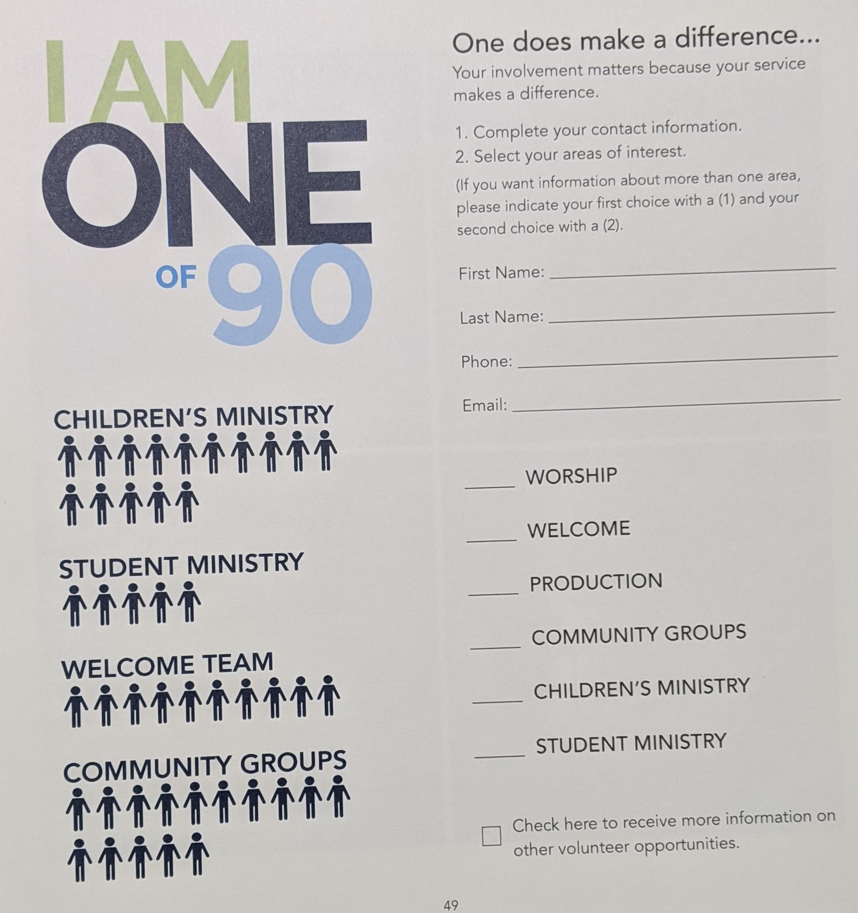

# Java Benchmark - BCCA Nomination

For this benchmark you are building software to automate processing volunteer sign-ups for churches. For a volunteer to placed inside the church, they must first fill out the interest form pictured below.



This form allows churches to collect and process volunteer interest from the congregation. Your job is to turn this form into a terminal application. Instead of filling out this paper form, the church wants to put a computer in their lobby with a program that allows a member to express interest in volunteering. Reference the form pictured above to determine what data is necessary from the user.

## Requirements

A user should be able to express volunteer interest in a similar format to the form pictured above.

Your code should be readable.

Your applications should be usable.

## Levels of Success

- **Needs Improvement**
  - Users can express volunteer interest, but the data isn't stored between program executions.
- **Meets Expectations**
  - Users can express volunteer interest, and the data is stored between program executions.
- **Exceeds Expectations**
  - A separate application is developed for church administrators:
    - Church administrators can view who is interested in each category.

## User Application Example Interaction

```
First name: Nate
Last name: Clark
Phone: 555-555-5555
Email: pan@cake.hungry
Are you interested in volunteering on the Worship team? (Yes/No) No
Are you interested in volunteering on the Welcome team? (Yes/No) No
Are you interested in volunteering on the Production team? (Yes/No) No
Are you interested in leading a Community Group? (Yes/No) No
Are you interested in teaching in Children's Ministry? (Yes/No) Yes
Are you interested in volunteering in Student Ministry? (Yes/No) No
Are you interested in hearing more information about volunteer opportunities? (Yes/No) Yes
Thanks!
We'll get back to you as soon as possible.
```

## Church Administrator Example Interaction

```
Hello!
3 people are interested in volunteering.
Nate Clark - 555-555-5555 - pan@cake.hungry is interested in: Children's Ministry
Joe Schmoe - 123-456-7890 - foo@bar.baz is interested in: Worship, Production
Yael Akerman - 0987-654-321 - yaker@man.com is interested in: Community Group, Student Ministry, More Info
```

## Submission

Email Sean, Nate, and Fernae a link to the Github repository containing your solution.
